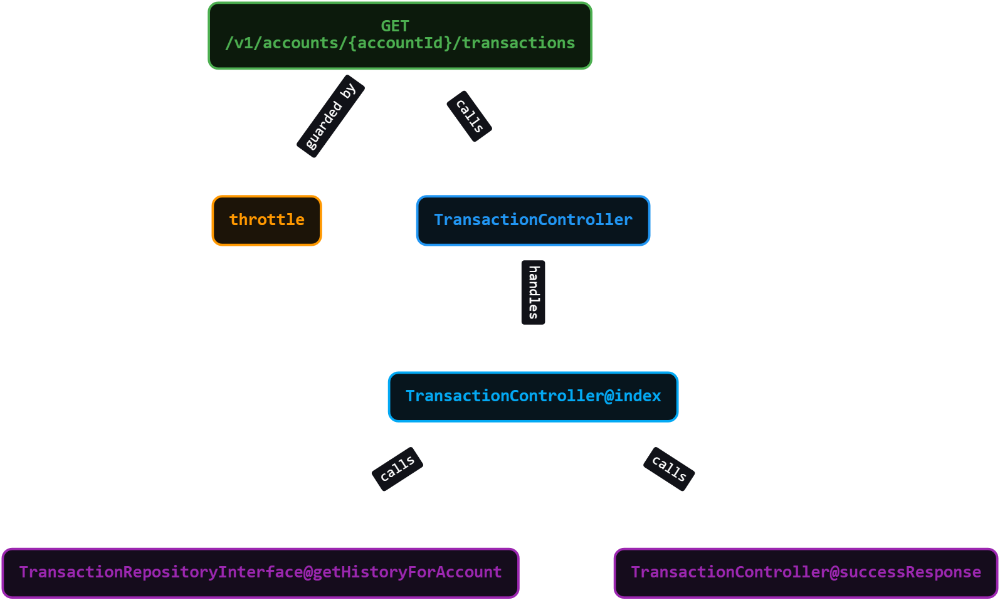
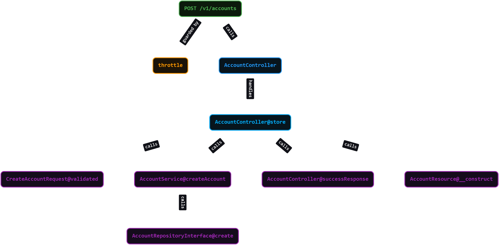
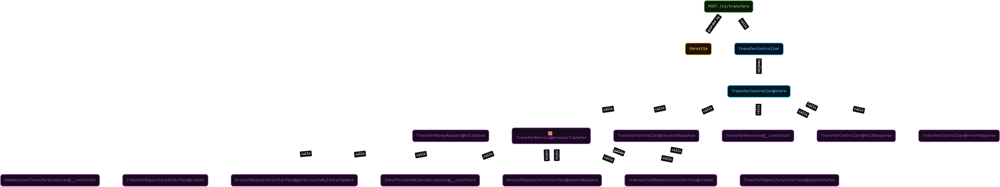
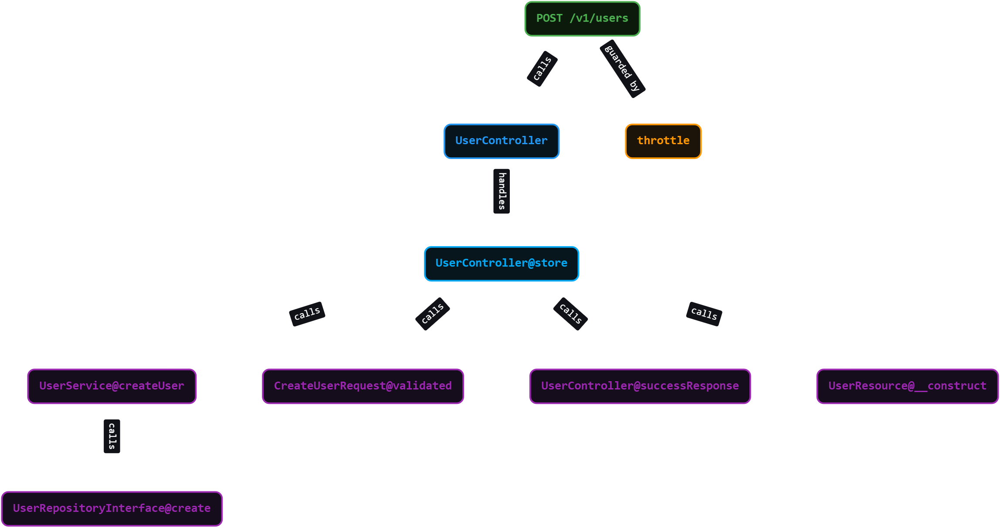

# Money Transfer API

A secure, transactional API for transferring funds between accounts, built with Laravel 12.

## Key Features
- **Atomic Database Locks:** Prevents deadlocks and race conditions.
- **Double-Entry Ledger:** Immutable audit trail via the transactions table.
- **UUIDs:** Non-enumerable primary keys prevent IDOR attacks.
- **Cent-Based Math:** Prevents floating-point precision issues.
- **Performance Tracking:** Appends `X-Response-Time` header to all endpoints.
- **AI-Assisted Development:** Built with the assistance of `laramint/laravel-brain` to ensure high-quality, architecturally sound, and rapidly developed code. You can view the architectural graphs locally at `http://127.0.0.1:8000/_laravel-brain`.

## Endpoint Architecture Flows

*The following execution flow diagrams were generated via `laramint/laravel-brain` to visualize the architectural path of each endpoint.*

### 1. Create User Flow


### 2. Create Account Flow


### 3. Process Transfer Flow


### 4. Fetch Transaction History Flow


## Setup Instructions

1. **Clone & Install**
   ```bash
   git clone <repo_url>
   cd money-transfers-task
   composer install
   ```

2. **Environment Setup**
   Copy `.env.example` to `.env` and set your MySQL credentials.
   ```bash
   cp .env.example .env
   php artisan key:generate
   ```

3. **Database**
   ```bash
   php artisan migrate
   ```

4. **Testing**
   Run the automated feature tests:
   ```bash
   php artisan test
   ```

## Postman Testing
A `Postman_Collection.json` is included in the root directory. Import it into Postman to easily test the endpoints. Make sure to update the `base_url` variable in Postman to match your local setup.